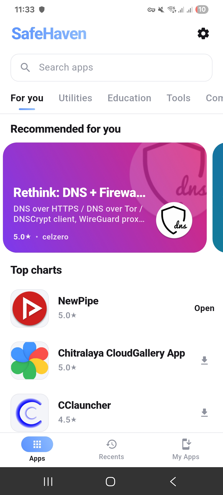
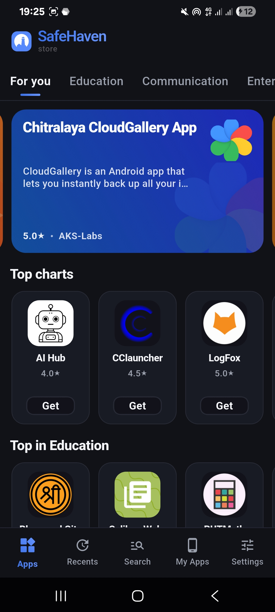
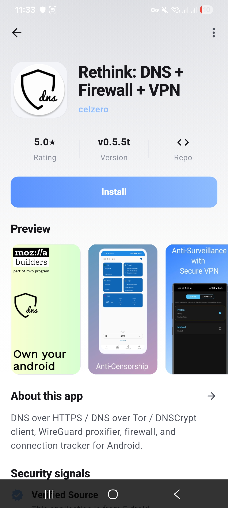
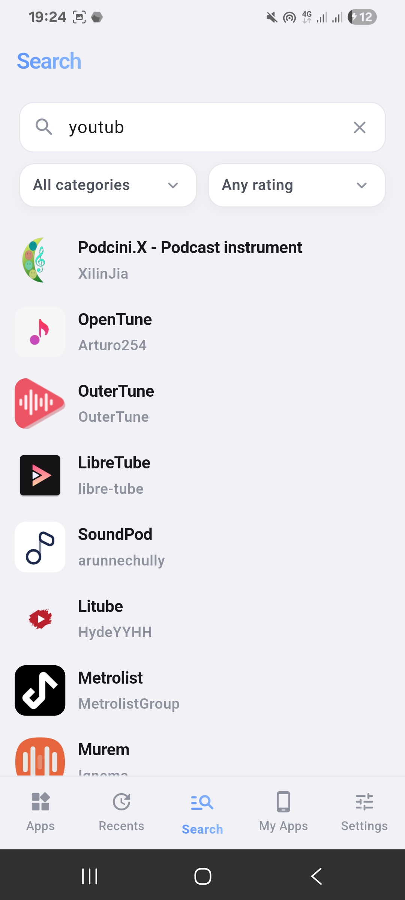

<p align="center">
  
</p>

<h1 align="center">SafeHaven</h1>

### Where open Android apps belong.

SafeHaven is an Android app store that is focused on trust, source visibility, and very clear app metadata. Apps can be linked to their source repositories, verified against developer ownership, scanned before release, and rechecked after being made available.

<p>
  
  
  
</p>

<p>
  <a href="https://buymeacoffee.com/ryanfromcolourswift">
    
  </a>
</p>

## What is SafeHaven?

SafeHaven is an Android app distribution platform built around transparency. Instead of using the 'trust me bro' methology, SafeHaven aims to show where the app comes from, whether the source has been verified, and if it has passed all malware checks. 

## Trust layers

| Layer | What it does |
|---|---|
| **Source linked** | Apps can include a public source repository. |
| **Verified Source** | The developer proves control of the linked repository by adding a .safehaven file in their repo during setup. |
| **Unverified listings** | Community/imported apps can be listed without claiming developer ownership. |
| **APK scanning** | Submitted APKs are scanned before being approved. |
| **Rechecks** | Apps can be rescanned after release to keep metadata fresh. |

## Screenshots

<table>
  <tr>
    <td width="50%" align="center">
      
    </td>
    <td width="50%" align="center">
      
    </td>
  </tr>
  <tr>
    <td width="50%" align="center">
      
    </td>
    <td width="50%" align="center">
      
    </td>
  </tr>
</table>

## App submissions

- Developers can register and manage their apps. SafeHaven checks submitted APKs through its scan pipeline before they become available in the public catalog.
- Community/imported listings are kept separate from verified developer listings.

Want to suggest an app? Use the [App Suggestions discussion](https://github.com/phsycologicalFudge/SafeHaven/discussions/categories/app-suggestions).

## Repository structure

| Area | What it contains |
|---|---|
| **Android client** | Store browsing, app pages, install flow, and UI. |
| **Store logic** | Catalog parsing, categories, app metadata, and listing display. |
| **server_code** | Backend/store server code for submissions, scanning, storage, and catalog generation. |

## APK signature verification

Official Android APKs published by ColourSwift are signed with the following certificate:

SHA-256: `9c67f4224888f60e093cf7eab9b194e6d4cd73bb11313638c47b17f0d5f34ec4`

You can also verify a downloaded APK with the Android SDK Build Tools command:

`apksigner verify --print-certs app-arm64-v8a-release.apk`

## Building the app

Make sure Flutter is installed, then run:

```bash
flutter pub get
flutter run
```

For a release APK:

```bash
flutter build apk --release
```

For an app bundle:

```bash
flutter build appbundle --release
```

## Current status

SafeHaven is still in early development.

## Project links

<p>
  <a href="https://github.com/phsycologicalFudge/SafeHaven">
    
  </a>
  <a href="https://discord.gg/VYubQJfcYM">
    
  </a>
</p>

## Licence

MIT
