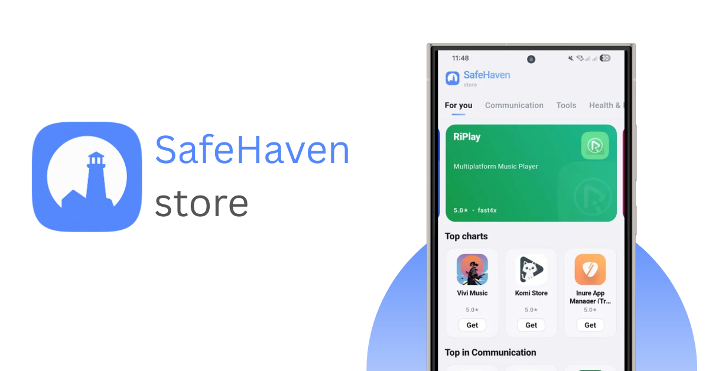

<p align="center">
  
</p>

<div align="center">

### SafeHaven: Where open Android apps belong.

SafeHaven is an Android app store that is focused on trust, source visibility, and very clear app metadata. Apps can be linked to their source repositories, verified against developer ownership, scanned before release, and rechecked after being made available.

[](https://github.com/phsycologicalFudge/SafeHaven/releases)
[](https://github.com/phsycologicalFudge/SafeHaven/releases)
[](LICENSE)

<a href="https://trendshift.io/repositories/51794?utm_source=trendshift-badge&amp;utm_medium=badge&amp;utm_campaign=badge-trendshift-51794" target="_blank" rel="noopener noreferrer"></a>

[](https://store.colourswift.com/app/com.colourswift.safehaven)
[](https://apt.izzysoft.de/packages/com.colourswift.safehaven)

</div>

---

> [!CAUTION]
> ### Android developer verification is coming...
> Android FOSS is under threat. From September 30, 2026, Google will require developer verification for all Android apps on certified devices, including those installed outside of the Play Store. https://keepandroidopen.org/

## What is SafeHaven?

SafeHaven is an Android app distribution platform built around transparency. Instead of using the 'trust me bro' methology, SafeHaven aims to show where the app comes from, whether the source has been verified, and if it has passed all malware checks. 

## Trust layers

| Layer | What it does |
|---|---|
| **Source linked** | Apps can include a public source repository. |
| **Verified Source** | The developer proves control of the linked repository by adding a .safehaven file in their repo during setup. |
| **Unverified listings** | Community/imported apps can be listed without claiming developer ownership. |
| **APK scanning** | Submitted APKs are scanned before being approved. |
| **Rechecks** | Apps can be rescanned after release to keep metadata fresh. |

## App submissions

- Developers can register and manage their apps. SafeHaven checks submitted APKs through its scan pipeline before they become available in the public catalog.
- Community/imported listings are kept separate from verified developer listings.

Want to suggest an app? Use the [App Suggestions discussion](https://github.com/phsycologicalFudge/SafeHaven/discussions/categories/app-suggestions).

## Repository structure

| Area | What it contains |
|---|---|
| **Android client** | Store browsing, app pages, install flow, and UI. |
| **Store logic** | Catalog parsing, categories, app metadata, and listing display. |
| **server_code** | Backend/store server code for submissions, scanning, storage, and catalog generation. |

## APK signature verification

Official Android APKs published by ColourSwift are signed with the following certificate:

SHA-256: `9c67f4224888f60e093cf7eab9b194e6d4cd73bb11313638c47b17f0d5f34ec4`

You can also verify a downloaded APK with the Android SDK Build Tools command:

`apksigner verify --print-certs app-arm64-v8a-release.apk`

## Building the app

Make sure Flutter is installed, then run:

```bash
flutter pub get
flutter run
```

For a release APK:

```bash
flutter build apk --release
```

For an app bundle:

```bash
flutter build appbundle --release
```

## Current status

SafeHaven is still in early development.

## How 'safe' is SafeHaven
Nobody can claim to be perfectly safe. However, SafeHaven leverages commercial security software in the live build to ensure malware doesnt slip through. Along with the work in progress BEP (build evaluation process), to ensure apps riddled with ads and trackers remain off the store.


## Project links

<p>
  <a href="https://discord.gg/VYubQJfcYM">
    
  </a>
  <a href="https://buymeacoffee.com/ryanfromcolourswift">
  
</a>
</p>

## Licence

## Licence
SafeHaven Store is split in two categories. The client code & Server code
- Client: MIT [LICENSE](./LICENSE)
- Backend/Server: AGPL-3.0 [server_code/LICENSE](./server_code/LICENSE)
